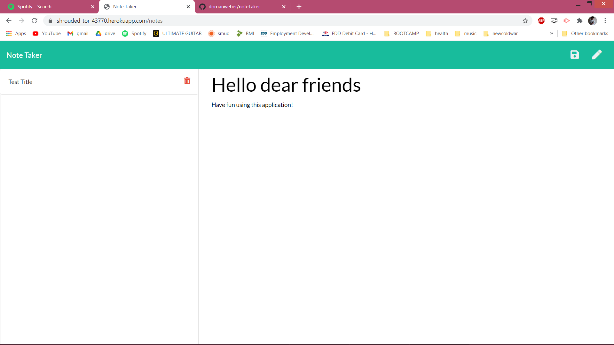

## Note Taker

## Table of Contents
1. [The Assignment](#the-assignment)
2. [Looking Forward](#looking-forward)
3. [Usage](#usage)
4. [Demonstration](#demonstration)
5. [Credits](#credits)
6. [Questions](#questions)

## The Assignment
Create the back end of an application where a user can create and save notes.

## Looking Forward
I would like to come back to this assignment and do the bonus criterion--getting the "delete" functionality up & running.

## Usage

Simply visit the website, type notes into the provided fields, and save them with the icon when finished.

## Demonstration

## Credits

I was helped in this assignment by my TA Ryan Skog in our tutoring session, as well as by TA Zac Warner & instructor Alex Kaufmann in office hours.

## Questions

For any questions or comments, here is my contact information.
 
GitHub: https://github.com/dorrianweber
 
Email address: dorrianweber@gmail.com
